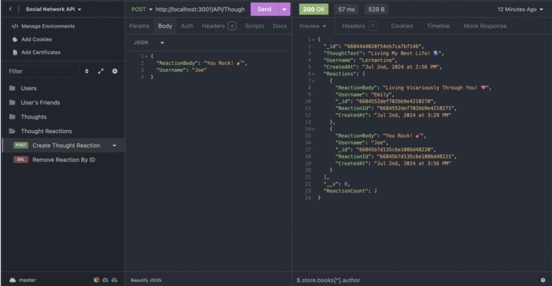

<div align="center">

<a href="./Assets/Images/README-Logo.svg"></a>

# Social Network API

<h3>An API for a social network web application where users can share thoughts, connect with friends, and react to their friends' thoughts!</h3>

[](https://github.com/emsim11)   

[](https://github.com/emsim11/Social-Network-API)

<p>
<a href="#description">Description</a> • 
<a href="#features">Features</a> • 
<a href="#installation">Installation</a> • 
<a href="#usage">Usage</a> • 
<a href="#support">Support</a> • 
<a href="#contributing">Contributing</a> • 
<a href="#credits">Credits</a> • 
<a href="#license">License</a> </p>

</div>

## Description

Motivation For Project

Reason For Building Project

How To Use The Project, Any Obstacles That Had To Be Overcome During Dev

### User Story

```md
As a social media startup

I want an API for my social network that uses a NoSQL database

So that my website can handle large amounts of unstructured data
```

### Acceptance Criteria

```md
Given a social network API

When I enter the command to invoke the application

Then my server is started and the Mongoose models are synced to the MongoDB database

When I open API GET routes in Insomnia for users and thoughts

Then the data for each of these routes is displayed in a formatted JSON

When I test API POST, PUT, and DELETE routes in Insomnia

Then I am able to successfully create, update, and delete users and thoughts in my database

When I test API POST and DELETE routes in Insomnia

Then I am able to successfully create and delete reactions to thoughts and add and remove friends to a user’s friend list
```

[Back to Top](#social-network-api)

## Features

- Key Features

[Back to Top](#social-network-api)

## Installation

Installation Steps

### Technologies

[](https://nodejs.org/en) [](https://www.npmjs.com/package/inquirer)

Technologies Used During Build

[Back to Top](#social-network-api)

## Usage

Instructions & Examples

### Visuals

#### User API Endpoints


#### Friend API Endpoints


#### Thought API Endpoints


#### Reaction API Endpoints




[Back to Top](#social-network-api)

## Support

[](mailto:emsimone11@gmail.com)

*Contact Information:*

If you have any questions, or additional feedback, please feel free to contact me. I will get back to you as soon as possible.

*Submit an Issue:*

If you are experiencing an issue with this application, please submit an [issue ticket](https://github.com/emsim11/Professional-README-Generator/issues).

[Back to Top](#social-network-api)

## Contributing


This project is not allowing other contributors at this moment.

[Back to Top](#social-network-api)

## Credits

[](https://github.com/emsim11)

Here are listed the sources that helped make this project possible.

### Authors

*The following developers helped create this project:*

[Emily Simone](https://github.com/emsim11) - Main Developer

### Repository Information

  

[Back to Top](#social-network-api)

## License

[](https://choosealicense.com/licenses/mit/)

&copy; 2024 Emily Simone

This application is licensed under the [MIT License](./LICENSE).

[Back to Top](#social-network-api)